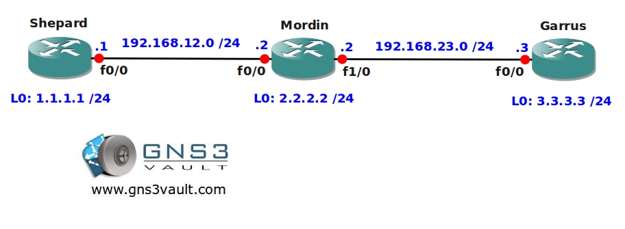

# MPLS Label Filtering

## Scenario
Your MPLS Backbone works like a charm but your security officer still has some issues. He doesn’t like that some of the prefixes are advertised with a label and it’s up to you to fix it….bring on the sticker remover!

## Goal
- All IP addresses on the customer routers have been preconfigured for you.
- OSPF has been configured on all routers and all networks are advertised.
- Configure MPLS on all routers, ensure all prefixes are advertised with a label.
- The prefixes on the loopback interfaces should NOT be advertised with a label.

