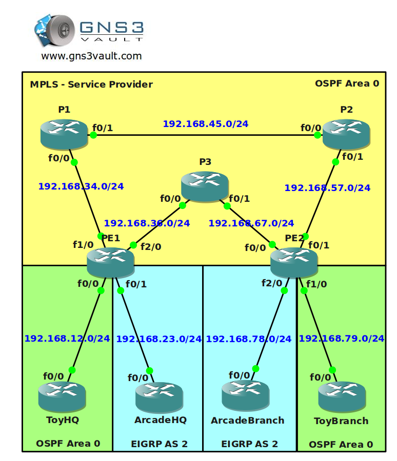

# MPLS Traffic Engineering per VRF

## Scenario

You are the senior network engineer for a large MPLS provider based in the United Kingdom. 2 of your customers called “Toy” and “Arcade” would like to use your MPLS services to connect their HQ and branch offices. Your MPLS backbone has multiple routers and one of the problems you encounter is that there is no load-sharing within the MPLS cloud. You need to make sure you can offer your customers L3 services and that your MPLS backbone has traffic engineering so you can share the load on all routers…time for some tagging & tunneling!

### Topology:

## Tasks

- Every router has a loopback0 interfaced configured.
- Configure OSPF Area 0 at the provider side (Router PE1,PE2,P1,P2 and P3).
- Advertise the loopback interfaces as well in OSPF.
- Make sure you advertise the loopback0 interfaces as /24 instead of the default /32 or you will run into trouble.
- Ensure you have full reachability in the OSPF domain.
- Configure MPLS on all physical interfaces in the service provider domain, do not configure MPLS on physical interfaces pointing towards the customer.
- Configure VRF “Toy” on PE1 and PE2 as following:
	* RD 100:1
	* Route-target both 1:100
- Configure VRF “Arcade” on PE1 and PE2 as following:
	* RD 200:1
	* Route-target both 1:200
- On router PE1 and PE2 add the interfaces pointing towards the customers to the VRFs you just created.
- Ensure you can ping from within the VRF, try this as following on PE1:
- ping vrf Toy 192.168.12.1
- Configure OSPF Area 0 on router ToyHQ and ToyBranch. Advertise the loopbacks as well.
- Configure EIGRP AS 2 on router ArcadeHQ and ArcadeBranch. Advertise the loopbacks as well.
- Configure OSPF and EIGRP on router PE1 and PE2 for the correct VRFs.
- Ensure you receive prefixes from the customer routers on your PE routers.
- Configure BGP AS 1 between Router PE1 and PE2.
- Configure the correct BGP address families and make sure communities are sent between neighbors.
- Redistribute OSPF and EIGRP into BGP, use the correct address-family for the VRFs.
- Ensure you have full connectivity for the customer networks. ToyHQ and ToyBranch should exchange OSPF prefixes and ArcadeHQ and ArcadeBranch should exchange EIGRP information.
- At this moment you should have a working MPLS network but all traffic is being sent through P3. We are going to use MPLS traffic engineering to use P1 and P2 as well.
- Configure the loopback10 interfaces on router PE1 and PE2 as the BGP next-hop for VRF Toy.
- Configure the loopback11 interfaces on router PE1 and PE2 as the BGP next-hop for VRF Arcade.
- Configure a tunnel10 interface on router PE1 and PE2 for VRF Toy. Make sure the tunnel is in MPLS traffic engineer mode.
- Configure the hold and setup priority to 1 for the tunnel 10 interface, set the bandwidth to 2000.
- Configure a tunnel11 interface on router PE1 and PE2 for VRF Arcade. Make sure the tunnel is in MPLS traffic engineer mode.
- Configure the hold and setup priority to 1 for the tunnel 11 interface, set the bandwidth to 2000.
- Configure the RSVP bandwidth to 2000 for all links interconnecting the P and PE routers.
- Configure MPLS traffic engineering tunnel support for all links interconnecting the P and PE routers.
- Finish your configuration so traffic for customer Toy is sent from PE1 through P1 and P2.
- Finish your configuration so traffic for customer Arcade is sent from PE1 through P3 and P2.

